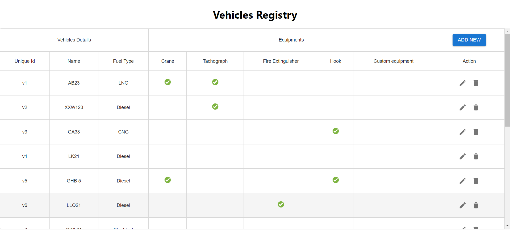
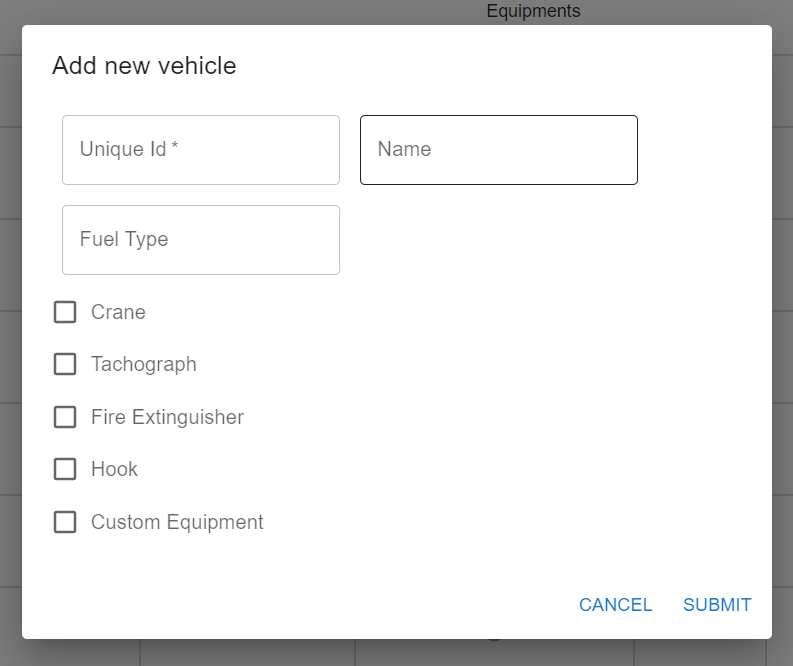
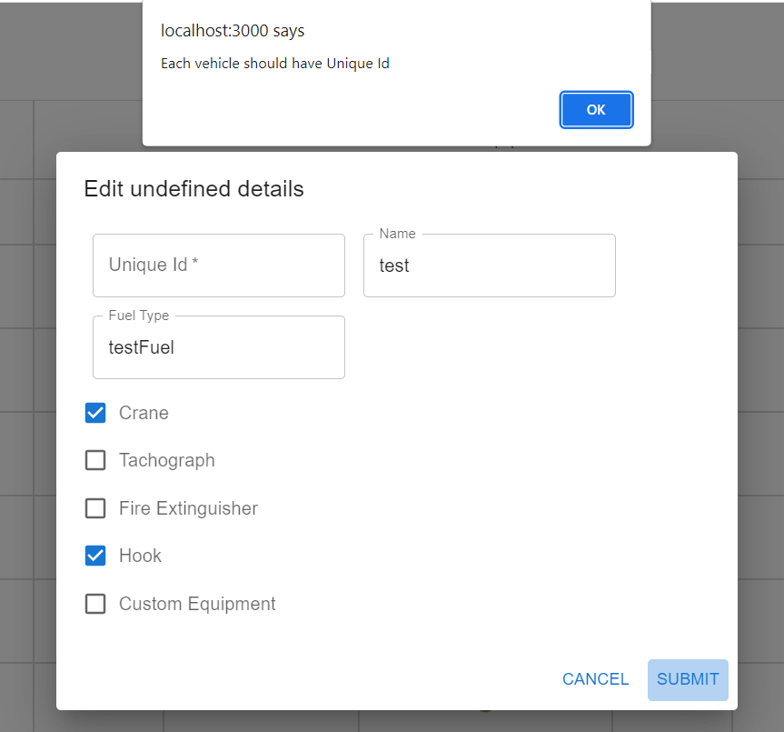
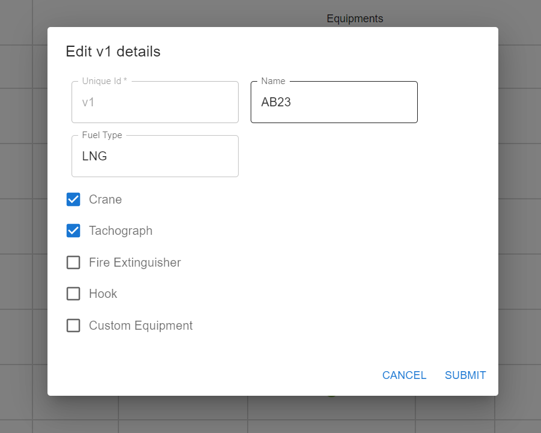
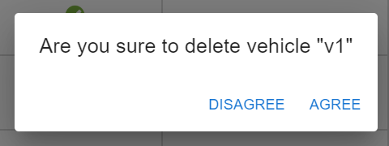

## Programming Languages used ReactJs

ReactJs is an open-source, front end, JavaScript library for building user interfaces or UI components.

## Installation

1)Use the package manager [NodeJs](https://nodejs.org/en/download/) to install NodeJs on your machine.

2)Verify Installation by opening a command prompt (or PowerShell), and enter the following: 'npm –v'

3. For installing application open your Command Prompt and then go to the repository on your machine (Example: cd ..your location..\vehicles-inventory)

4. Then type 'npm install' and enter to download all dependecies for application.

5. yippee you have completed installation and ready to run application.

## Usage

1)For starting application open your Command Prompt and then go to the repository on your machine (Example: cd ..your location..\vehicles-inventory)

2. Then type 'npm start' and enter to start application.

3. The application will automatically open the web page.

4. Enjoy the page.

## Testing

1)For testing application open your Command Prompt and then go to the repository on your machine (Example: cd ..your location..\vehicles-inventory)

2. Then type 'npm test' and enter to start testing application.

3. The application testing status will be shown in Command Prompt.

## Features

1. Home screen with vehicle registry.
   

2. Add new Vehicle by dialog box.
   

3. Warning when try to Add new Vehicle without unique id.
   

4. Edit Vehicle by dialog box.
   

5. Add and edit use same dialog box.

6. Delete conformation Dialog box.
   

7. Vehicles and equipments are loaded from supplied json file.
